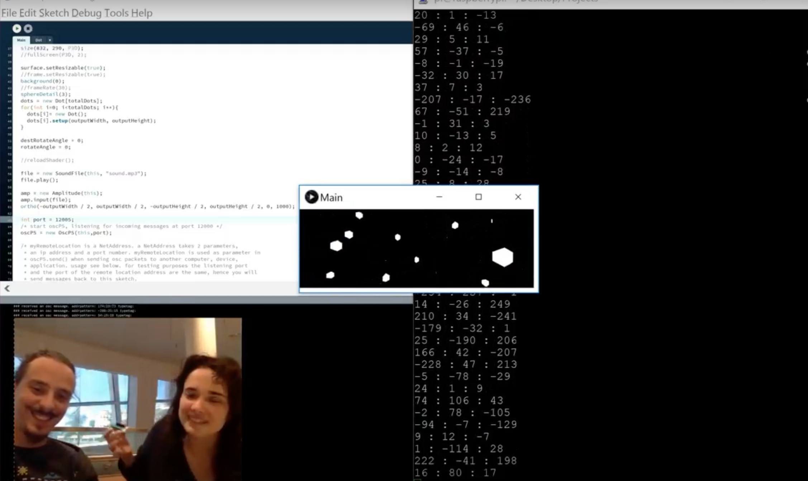

# Visualistas

### Diagram

### 1st Prototype
[]
(http://www.youtube.com/watch?v=SubBu9SJkpQ)

Source: http://www.youtube.com/watch?v=SubBu9SJkpQ

### Challanges
- [x] [Read accelerometer data from beam plus](https://github.com/Vamoss/visualistas/blob/master/lightblue-beanplus/main.c#L11 "Read accelerometer data from beam plus")
    - [ ] Stabilize signal
- [x] [Read the bluetooth signal on raspberry pi](https://github.com/Vamoss/visualistas/blob/master/raspberry-python/main.py#L55 "Read the bluetooth signal on raspberry pi")
    - [x] [Send data via OSC to Processing](https://github.com/Vamoss/visualistas/blob/master/raspberry-python/main.py#L72 "Send data via OSC to Processing")
    - [ ] Make fallback in case of connection loss
	- [ ] Decrease delay
- [x] [3D visuals following accelerometer](https://github.com/Vamoss/visualistas/blob/master/processing3/Main/Main.pde#L57 "3D visuals following accelerometer")
    - [ ] Add color complexity
    - [ ] Add moviment complexity
	- [ ] Add lighting effects

### Authors
- [Marina Avila](https://github.com/MarinaAvila)
- [Carlos Oliveira](https://github.com/vamoss)

#### Tutors
- [Henriette Bier](https://staff.tudelft.nl/H.H.Bier/)
- [Alex Liu Cheng](https://www.tudelft.nl/staff/a.liucheng/)

#### Collaborators
- [Marcela Sabino](https://www.linkedin.com/in/marcela-sabino-4564895/)
- [Ricardo Weissenberg](https://www.linkedin.com/in/ricardo-weissenberg-8583ba124/)
- [Eduardo Migueles](https://www.linkedin.com/in/eduardo-migueles-05009612a)