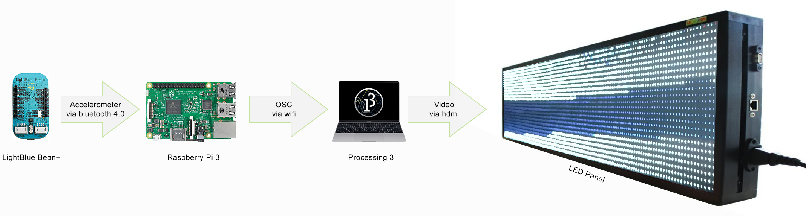
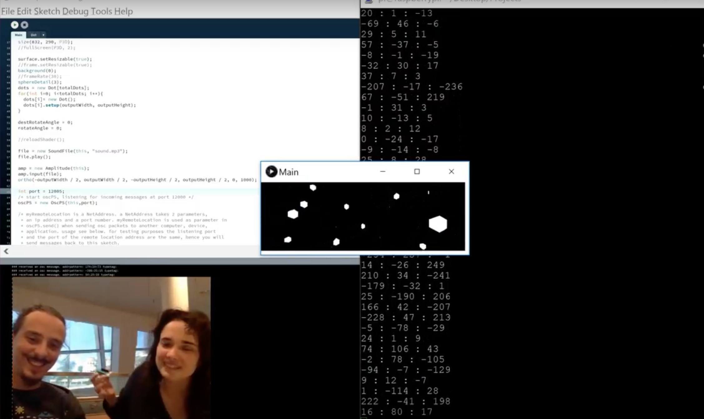

# Visualistas

### Diagram

### The start

The Visualistas Project was developed during a 3 days workshop in the 8th edition of Hiperorgânicos - International Symposium on Research in Art, Hybridization, Biotelematics and Transculturalism that took place between the 22nd - 27th of May 2018 on Museu do Amanhã, Rio de Janeiro - Brazil.

The workshop leaders were Henriette Bier and Alexander Liu Cheng and their objective was to introduce students to Design-to-Robotic-Operation (D2RPO) in order to achieve physical and sensorial reconfiguration.

With that in mind we decided to create somethings that would be immerseve and have the power to connect machine and user.

### What we wanted to do?

We wanted to use the lightblue bean+ from Punch Through development platform and the LED panel on the Museu do Amanhã Lab.

The bean+ is a wirelessly programmable microcontroller with an accelerometer sensor, bluetooth and batteries build in that uses standard Arduino Libraries.

The microcontroler was held in an acrylic sphere that could give us feedback about the information that was sent to the LED panel. Talking to the workshop leaders we decided to use the device to make a deeper connection with the user's childhood memory using common toy's logic.

That toy consists in a sphere with a role in the center that goes from one end to another. In this role there are two strings, the two players stand in opposite sides holding each end of the string on his side with each hand. When he separates his hands the sphere goes in direction of the other player.

This would expose the sensor to a big deal of acceleration wile connecting the users, not only to the LED panel, but also to their childhood memories playing with "vai-vem".

### 1st Prototype

Source: http://www.youtube.com/watch?v=SubBu9SJkpQ

### Challenges
- [x] [Read accelerometer data from beam plus](https://github.com/Vamoss/visualistas/blob/master/lightblue-beanplus/main.c#L11 "Read accelerometer data from beam plus")
    - [ ] Stabilize signal
- [x] [Read the bluetooth signal on raspberry pi](https://github.com/Vamoss/visualistas/blob/master/raspberry-python/main.py#L55 "Read the bluetooth signal on raspberry pi")
    - [x] [Send data via OSC to Processing](https://github.com/Vamoss/visualistas/blob/master/raspberry-python/main.py#L72 "Send data via OSC to Processing")
    - [ ] Make fallback in case of connection loss
	- [ ] Decrease delay
- [x] [3D visuals following accelerometer](https://github.com/Vamoss/visualistas/blob/master/processing3/Main/Main.pde#L57 "3D visuals following accelerometer")
    - [ ] Add color complexity
    - [ ] Add moviment complexity
	- [ ] Add lighting effects

### Authors
- [Marina Avila](https://github.com/MarinaAvila)
- [Carlos Oliveira](https://github.com/vamoss)

#### Tutors
- [Henriette Bier](https://staff.tudelft.nl/H.H.Bier/)
- [Alex Liu Cheng](https://www.tudelft.nl/staff/a.liucheng/)

#### Collaborators
- [Marcela Sabino](https://www.linkedin.com/in/marcela-sabino-4564895/)
- [Ricardo Weissenberg](https://www.linkedin.com/in/ricardo-weissenberg-8583ba124/)
- [Eduardo Migueles](https://www.linkedin.com/in/eduardo-migueles-05009612a)